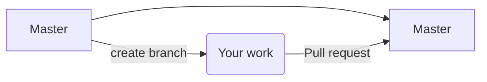

# Welcome to EB GUIDE Internship

## Preparation:
* Install Git on your PC (https://git-scm.com/)
* Clone repository https://github.com/liviuungureanu95/PracticaEB2020.git
* Install EB GUIDE Community Edition (https://www.elektrobit.com/ebguide/try-eb-guide/)
>**Note:** Operating system: Windows 10 (64-bit). 
>In addition: Microsoft .NET Framework 4.7.2 or later

## First step:

* Create and switch to a new branch (e.g. *firstname_lastname_create_working_directory*) and push.
* Add a new folder (e.g. *firstname_lastname*) and add the readme file. Add this change, commit and push.
>**Note:** Each member will use his/her own folder to upload the project.

* Create a pull request to merge your modifications to master. 
    - Assign it to yourself and add reviewers (alincabel, liviuungureanu95)
    - After approval, it will be merged on master by Alin or Liviu.
    
>**Note:** Do not commit changes on master. Always create a branch and start a pull request.

## Choose project(s)

* Once you decided you want to start working on your EB GUIDE project, go to your *firstname_lastname* directory, create a new folder with the name of your project (e.g. *MyProject*).
* Edit the Readme file and add a brief description of your project.
>**Note:** For versioning, you will commit your work in your development branch. (No need to create a pull request yet)

